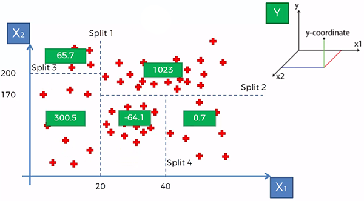
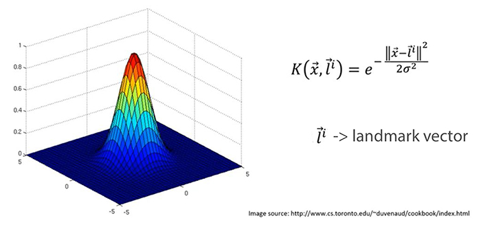
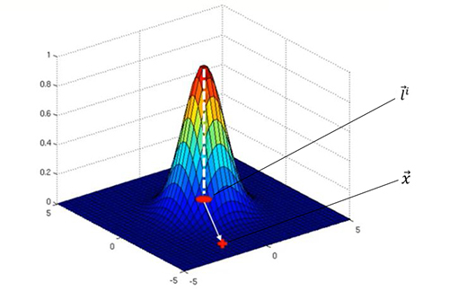
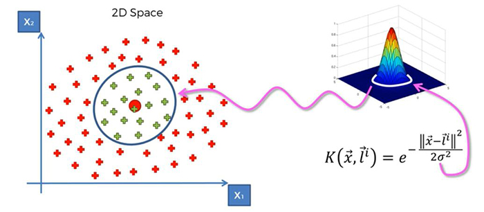
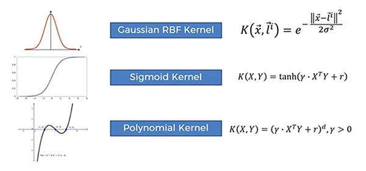
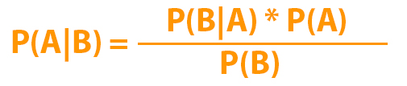

# Theory knowledge necesarry for Data Science

This is a markdown file containing information about all models that we have built and also some small mathematical processess that may have happened in between.

---

## Table of contents:

| Topic                 |                                |
|-----------------------|--------------------------------|
| Data Preprocessing    | [Jump](#data-preprocessing)    |
| Regression Models     | [Jump](#regression-models)     |
| Classification Models | [Jump](#classification-models) |

---

### Data Preprocessing

The first step to any data science model is preprocessing the data. This includes:  
* Importing data from a csv file.
* Getting dependent and independent variables from that data.
* Encoding any categorical data if present.
* Taking care of any missing values.
* Spliting the data into trainning and test set.
* Apllying feature scaling if needed.

Most of the points of data processing are prety straight forward. So, we will only talk about how *missing values* are taken care of and the *feature scaling* just to undertand the concept

When there is a value missing in our data it can affect our whole model predictions so we generally take care of that using the mean of that whole column but other methods like using meadian can also be used.

Feature scaling is done to bring the whole data on similar scale so that the model don't neglect some values due to the huge difference in values. For example if we have two columns like age and salary, the model may not consider age as it would be a two digit number while salaries would be in thousands.  

We have two ways of doing feature scaling -
* Standardization  
* Normalization

Here-  
μ is mean  
σ is Standard Deviation

Normalization can only be done to a data that follows a normal curve and makes all values between 0 and 1.  
Standardization can be done to any data and makes all values between -3 and 3.

###### Progress List

- [x] ~Data Preprocessing~
- [ ] Regression Models
- [ ] Classification Models

[Go to top](#theory-knowledge-necesarry-for-data-science)

---

### Regression Models

**Jump to a Model :** [Simple Linear Regression](#simple-linear-regression), [Multiple Linear Regression](#multiple-linear-regression), [Polynomial Regression](#polynomial-regression), [Support Vector Regression](#support-vector-regression), [Decision Tree Regression](#decision-tree-regression), [Random Forest Regression](#random-forest-regression)

#### Simple Linear Regression

A simple linear regression will predict a straight line following the equation : **y = b0 + b1 * x**  
From all the possible regression lines the best line is choosen by seeing that the sum of squares of distances of all vector points from the line is minimum. This method is called *Ordinary Least Squares.*

#### Multiple Linear Regression

Multiple linear regression is similar to the Simple linear regression except that this one will have multiple independent variables.  
It follows the equation: **y = b0 + b1 * x1 + b2 * x2 + ... +  + bn * xn**  
A 2D graph cannot be plotted for so many variables

#### Polynomial Regression

Polynomial Regression follows a curve and find the best fitting curve using the same concept as other regression models.  
It will follow the equation: **y = b0 + b1 * x + b2 * x^2 + ... + bn * x^n**

#### Support Vector Regression

In this type of regression the Ordinary Least Square method is applied after providing a little slack, slack bring a tube around the line to neglect errors.

#### Decision Tree Regression

In Decision Tree Regression the independent variables are plotted on a graph and the plot area is splitted into multiple leaves.  
Each leaf is decided by two factors:  
* Upon split each leaf should give more information.
* No leaf should have less than 5% of total data.

This process is called *Information Entropy* and the final leaves that we get are called *Terminal Leaves*.  
The predicted y value will be the average of all y values for the leaf our variables fall on.

#### Random Forest Regression

Random Forest Regression uses combining or repeating algorithms to get a result. This process is calles *Ensemble Learning*.  
Tree regression is run on random data vectors multiple times and the result from all of them is averaged to get a final prediction.  
That is probably why there is a forest in the name. 😉

###### Progress List

- [x] ~Data Preprocessing~
- [x] ~Regression Models~
- [ ] Classification Models

[Go to top](#theory-knowledge-necesarry-for-data-science)

---

### Classification Models

**Jump to a Model :** [Logistic Regression](#logistic-regression), [K Nearest Neighbor](#k-nearest-neighbor), [Support Vector Machine](#support-vector-machine), [Kernel SVM](#kernel-svm), [Naive Bayes](#naive-bayes), [Decision Tree Classification](#decision-tree-classification), [Random Forest Classification](#random-forest-classification)

#### Logistic Regression

Imagine a linear regression line for points showing probability of some thing depending on some variables.  
Example : For 1 variable **y = b0 + b1 * x**  
We take a sigmoid function **p = 1 / (1 + e^-y)**  
Substitute the value of y to get final equation: **ln(p / (1 - p)) = b0 + b1 * x**  
Thats how our straight line is converted to the curve seen in the image and this is the equation for Logistic Regression.  
This model can return the probability of classification or just 0 or 1 depending on which side is the probability vector closest to.

#### K Nearest Neighbor

As shown in the image, the model will predict which category a new datavector will be classified in.  
The distance for k number of the nearest neighbors are choosen. Then, there distance from the new datavector is calculated preferably using **Euclidean Distance : ((y2 - y1)^2 + (x2 - x1)^2)^(1/2)**.  
Then the number of datavectors in each category are counted and new vector is classified as the category with most k neighbors.  

#### Support Vector Machine

As in Support Vector Regression, there is a tube around seperator which passes through the closest points to seperation such that the margin is maximum as shown in the image below. Also, both support vectors will be equi-distant from the line.

#### Kernel SVM

Sometimes, we have data that is non lineary seperable as shown below. For such data we use Kernel SVM.

We can take following approaches to build a kernel SVM:  
* **Mapping to a Higher Dimension**  
   Basically when we map our data to a higher dimension we ussualy get a seperator. Thus, we convert the non liarly seperable data to lineraly seperable data by mapping to a higher dimension.

   

   When our data is non linearly seperable, mapping it to a higher dimension can help make it linearly seperable. So we convert our data from 2D to 3D then find the seprator hyperplane and then map it back to 2D to get our non linear seperator.

   

   However, this method is not generally used as it require a very high processor to do all those tasks. We generally use the next given approach.

* **Kernel Trick**
  * **The Gaussian or RBF Kernel**  
    Gaussian and Radial Basis Function are interchangable terms and follows the following equation.

    

    The landmark vector is the point (0,0) in the 3D representation and then there is x vector. As seen in the formula the Kernel function is inversly propotional to the distance of x and landmark vectors. So, for a huge distance K will be closer to 0 and as the distance keeps increasing K will come closer to 1. That is the 3D representation shown in the next image.

    

    The sigma in the formula decides the circumfrence of the seperator. Any point within the seperator is on the 3D part (aqquiring value between 0 & 1) and any point outside it are on horizontal plain (aquiring value 0).

    

    This method dosen't actually map the data into a higher dimension. It just uses the function to calculate the position of the seperator. Thus, it dose not require as much of comutational processing.

**Types of Kernel Functions**

These are the main kernels that we use, although there are other types also.  
[Here](https://towardsdatascience.com/kernel-function-6f1d2be6091) is an article explaining kernels that you can read.  
[Here](https://data-flair.training/blogs/svm-kernel-functions/#:~:text=The%20function%20of%20kernel%20is,(RBF)%2C%20and%20sigmoid.) is an article explaining all types of kernels.

#### Naive Bayes

###### Bayes Theorem

Bayes' theorem is a formula that describes how to update the probabilities of hypotheses when given evidence. It follows simply from the axioms of **conditional probability**, but can be used to powerfully reason about a wide range of problems involving belief updates.

Lets try and understand it using an example:

>Imagine there two be two machines, manufacturing a same identical item. Both machines manufacture at different rates and some of the manufactured items are defected. We have the following information:  
> - Machine 1 manufactures 30 items / hour.
> - Machine 2 manufactures 20 items / hour.
> - Out of all manufactured items 1% are defective.
> - Out of all manufactured items 50% came from machine 1 and rest 50% came from machine 2.
>
> **Question:** What is the probability that a item manufactured by machine 2 is defected?
>
> Lets write the given information in mathematical terms:
>
> *Probability of an item picked up at random being manufactured by machine 2*  
> **P(M2)** = 20/50 = 0.4
>
> *Probability of an item picked up at random being defective*  
> **P(Defect)** = 1% = 0.01
>
> *Probability of an item picked up at random being manufactured by machine 2 **given** that it is defected*  
> **P(M2|Defect)** = 50% = 0.5
>
> **Answer:** *We have to find the probability of an item picked up at random being defective **given** the item is manufactured by machine 2*  
> According to Bayes theorem: **P(Defect|M2) = (P(M2|Defect) * P(Defect)) / P(M2)**  
> P(Defect|M2) = 0.0125 = 1.25%
>
> *Lets test the theorem by taking an example of 1000 items:*  
> *We know machine 2 produces 40% so i.e. 400 items.*  
> *1% of the items are defected i.e. 10 items.*  
> *50% of the defected are from machine 2 i.e. 5 items.*  
> *=> Percentage of defected from machine 2 = 5/400 = 0.0125*

#### Decision Tree Classification

#### Random Forest Classification

###### Progress List

- [x] ~Data Preprocessing~
- [x] ~Regression Models~
- [x] ~Classification Models~

[Go to top](#theory-knowledge-necesarry-for-data-science)

---